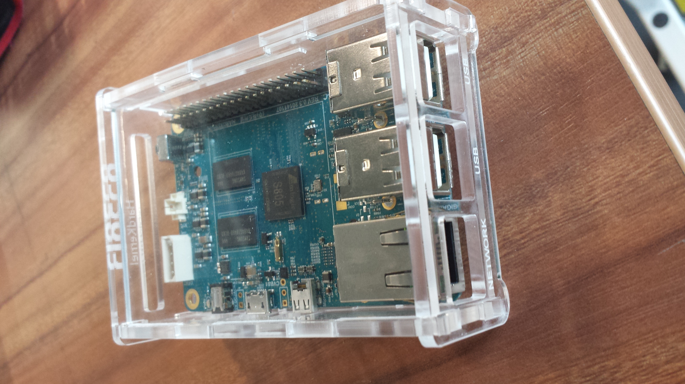

## Odroid C1 Acrylic Casing design files

Download, edit and laser cut your own casing!

###### Possible enhancements for V1.1 casing design

- Support the placement/removal of eMMC module
- Adjust the opening for Power/OTG/HDMI
- Open a wider vertical slot to fully expose the IR receiver
- Do a transition fit adjustment to that the board doesn't rotate about the centre in the casing
- Open a slot on the top piece to support the addition of a mini cooling fan

###### References

Original design by Adafruit for Rpi A/B at: http://www.thingiverse.com/thing:24461

Adafruit Pi Box sold here: http://www.adafruit.com/product/859

Pull requests are super welcome but do remember to keep the license text intact and respect Adafruit's effort while supporting open source designs! :)
